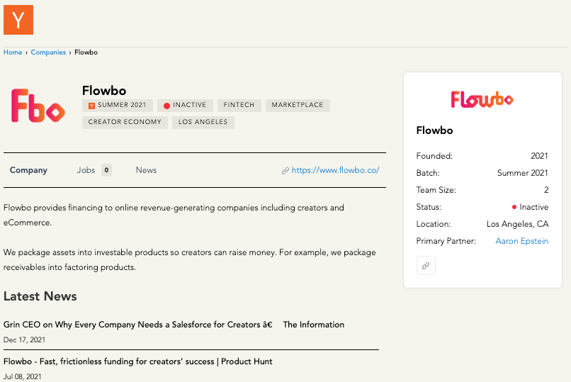

## Agent产品案例深度拆解

### 我为什么选择这个课程

我选择这个课程，其实不是因为“Agent”这个词有多新，而是因为我越来越明显地感觉到：
> AI 这一波，已经开始从技术问题，变成产品问题了。

回头看自己这些年的经历，从PC互联网到移动互联网，再到今天的AI，其实每一次技术浪潮都有一个共同点：
> 刚开始，大家讨论的都是“技术有多厉害”
> 但真正决定谁能走远的，永远是“产品怎么把技术用好”

2022年底的ChatGPT刚出来的时候，就是一个典型的技术驱动阶段。那时候它甚至算不上一个成熟产品，但只要能对话、能生成内容，本身就足够震撼。用户第一次意识到：原来 AI 可以这么“像人”。

> 但那种震撼，很快就会过去。
> 真正让我开始认真思考的，是接下来发生的事情。

我对产品和需求的看法是，进入现在这个阶段，我越来越清楚地感受到：
> 我们已经不在“技术证明可行”的阶段了，而是在“技术和用户一起拉扯”的阶段

像Cursor这样的产品，最早只是“IDE + AI Copilot”，听上去就是个工具增强。但它后来不断演进，把编辑、修改、理解代码的能力逐渐藏进用户真正使用的路径里。这不是单纯的模型升级，而是产品在不断试探：
> 用户到底能接受AI介入到哪一步？
> 在哪一步会觉得“好用”，在哪一步会觉得“被打扰”？

这正是我选择这个课程的原因。
通过讲解人讲解以及所谈及的案例，加上感兴趣的案例，我想搞清楚：
> Agent在真实产品里，究竟是怎么被设计、被限制、被“驯化”的。
> 站在产品角度，Agent从来不是“能力越强越好”，而是“在对的地方出现”。

### 感受1 - “我敢不敢让用户用”Agent

课程里结合红杉资本的数据时，我想到的是：互联网时代，真正做到营收十亿美元级别的公司，绝大多数都在应用层，而不是基础技术层。AI时代，很可能还是这个规律。基础模型会越来越强，但能不能被用户真正用起来，取决于产品怎么把复杂能力变成简单体验。

这也解释了一个我最近越来越强烈的感受：
> 技术的进步是连续的，但产品机会是阶段性的。
> 模型在进化，但用户的理解、习惯、信任感，都是慢慢建立的。
> Agent产品的价值，不在于“我能不能做”，而在于“我敢不敢让用户用”。

### 感受2 - Agent本质上是一次产品范式变化

在学习 Agent 案例的过程中，我最大的收获其实不是某一个具体产品，而是一个整体认知的变化。虽然我也开发产品、做API等，但是以前自己的想法可能不那么专业，与讲解人（甚至是其它的**成功的产品**的产品经理）相比较而言。

以前我们做产品，习惯的是：
> 用户点一下 → 系统返回结果 → 流程结束

但Agent带来的，是一种完全不同的体验方式：
> 系统不再只是“被调用”，而是开始持续参与用户的目标过程

这对产品设计的影响非常大。
> 什么时候该让 Agent 主动？
> 什么时候必须让用户确认？
> 什么时候要“装傻”，而不是“显得很聪明”？

**结论：这些问题，本质上都不是技术问题，而是产品判断。**

### 最后的总结

学完Agent产品案例之后，我对这个方向的判断需要更冷静了，而不仅仅是专业化。

我们现在所处的阶段，既不是单纯的技术萌芽期，也还远没到完全成熟期，而是一个技术能力和用户需求不断互相试探的上升期。这个阶段一定会很乱，也一定会出很多“看起来很聪明但活不久”的产品，最近也出现了一些聊显或嫌疑为“噱头”的产品。

真正有价值的Agent产品，不是炫技型的，而是能把复杂能力藏起来，让用户在不知不觉中完成更多事情的那一类。

对我来说，这门课的价值不在于“教我怎么做 Agent”，而在于帮我重新校准了一个问题：
> 在AI时代，产品经理真正要做的，依然是理解人
> 只是这一次，我们多了一个非常强但也非常不稳定的合作者——Agent

## 作业：拆解一个项目

我选择的是Flowbo，从YC项目链接找到的，如下：
[Flowbo](https://www.ycombinator.com/companies/flowbo-inc)

> Flowbo的拆解
> 该产品的本质是帮创作者把“未来能确定拿到的钱”
> 提前变现，解决等钱慢、现金流紧的问题。
> 它不靠噱头，靠的是对创作者收入稳定性的判断。
> 能不能做大，关键不在拉多少用户，而在风控准不准、坏账能不能压住。

### 状态

✅ 已完成打卡

